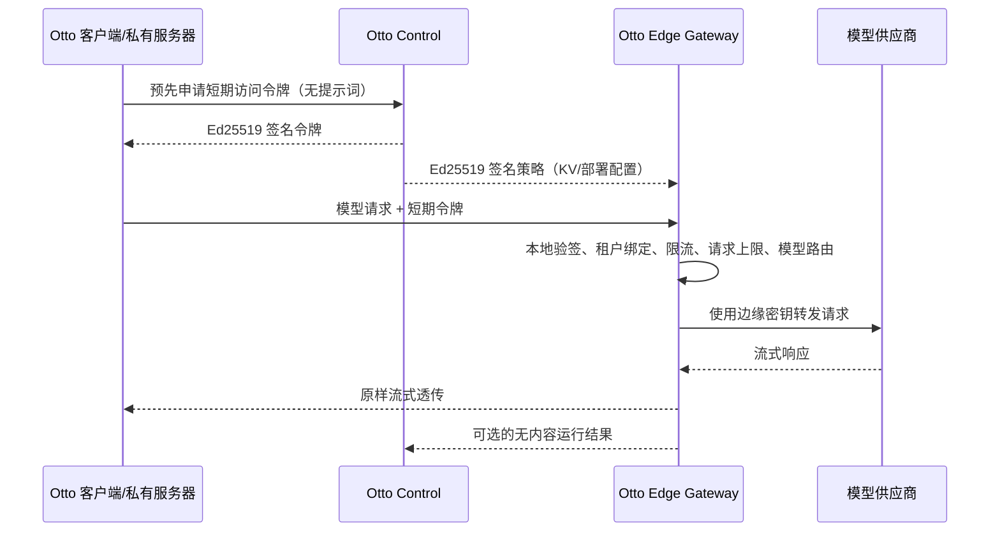

# Otto Edge Gateway 第一阶段设计与运行基线

## 当前交付状态

本阶段建立了可执行的 Edge Gateway 核心、Node 独立进程入口、阿里云 ESA
Web Service Worker 适配器、PostgreSQL 策略配置、Control 正式签发 API 和安全
回归测试。Control 已校验部署、企业、在线 License、机器指纹、租约令牌和余额
准入，但完整计费预留、分布式限流及云部署自动化尚未完成，因此仍不能标记为
正式生产版本。

核心代码只依赖标准 Web API：`Request`、`Response`、`fetch`、
`ReadableStream` 和 Web Crypto。Node、阿里云 ESA 及未来 Cloudflare 只负责
适配运行环境，不能把平台 API 反向渗入核心。

## 信任与数据边界



必须长期保持以下安全不变量：

- Control 不进入模型请求的在线转发链路，只签发短期令牌和路由策略。
- Control、PostgreSQL、审计和运行结果不得接收提示词、回复、附件、会话上下文或
  模型密钥。
- 客户端只能选择策略公开的模型名，不能提供上游 URL、认证头或密钥绑定。
- 上游地址必须来自签名策略，并且只能是无凭据、无查询参数的 HTTPS URL。
- 模型密钥由边缘运行时的 Secret 管理能力提供，不写入策略、KV、日志或仓库。
- 策略失效、签名错误、令牌失效、密钥缺失时全部 fail-closed。
- BYOK 模式不经过托管 Edge Gateway，由客户端或私有服务器直连模型供应商。
- Edge 不承担聊天历史、知识库、附件或工作流状态存储。

## 已实现协议

Control 签发两类 Ed25519 信封，两者与 Otto 现有 `canonicalJson` 签名格式兼容：

1. 网关策略：绑定部署、企业、策略版本、公开模型、上游固定路由、Secret Binding、
   请求上限、每分钟速率、连接超时、流空闲超时和最大故障切换次数。有效期最长
   24 小时。流空闲超时范围为 1–300 秒。
2. 访问令牌：绑定部署、企业、账号、策略版本和模型白名单。有效期最长 15 分钟，
   默认 5 分钟。

网关当前提供以下兼容入口：

- `POST /v1/chat/completions`
- `POST /v1/responses`
- `GET /healthz`

Control 提供以下控制面入口：

- `PUT /v1/admin/deployments/:deploymentId/edge-gateway-policy`：持久化并审计策略；
- `GET /v1/admin/deployments/:deploymentId/edge-gateway-policy`：查询当前策略；
- `POST /v1/edge-gateway/policy/resolve`：签发 15 分钟策略信封；
- `POST /v1/edge-gateway/access-tokens`：签发默认 5 分钟的模型访问令牌。

两个部署入口都要求在线 License 的租约令牌，以及 `x-otto-timestamp`、
`x-otto-nonce`、`x-otto-signature`。签名算法与遥测请求相同：以租约令牌作为
HMAC-SHA256 密钥，对时间戳、nonce 和规范化请求体签名。nonce 持久化到
PostgreSQL 并一次性消费，跨实例重放会被拒绝。请求体采用字段白名单，不能携带
消息、提示词、上下文、上游 URL 或供应商密钥。

当前路由面向 OpenAI-compatible JSON 协议；网关只重写顶层 `model`，并以
`ReadableStream` 透传上游响应。429、502、503 和 504 可按签名策略的优先级
切换备用路由，其他 4xx 不会自动重试。连接超时只覆盖取得响应头之前；取得响应头
后，每次等待上游数据块都受 `upstreamIdleTimeoutMs` 约束。下游取消或连接断开会
中止供应商请求，避免无人接收的生成任务继续消耗 Token。

## 本地独立运行

先准备两个只读文件：

- `OTTO_EDGE_POLICY_FILE`：Control 签名的 `SignedEdgeGatewayPolicyV1` JSON。
- `OTTO_EDGE_CONTROL_PUBLIC_KEYS_FILE`：`signingKeyId -> Ed25519 SPKI PEM` 的 JSON。

策略中的每个 `secretBinding` 对应同名进程环境变量。例如
`PROVIDER_A_API_KEY`。然后运行：

```powershell
$env:OTTO_EDGE_POLICY_FILE='D:\secure\edge-policy.json'
$env:OTTO_EDGE_CONTROL_PUBLIC_KEYS_FILE='D:\secure\control-public-keys.json'
$env:PROVIDER_A_API_KEY='从密钥管理服务注入的值'
npm run dev:edge
```

默认只监听 `127.0.0.1:7790`。生产环境应在前方终止 TLS，且必须改用正式的
分布式限流器；内置 `InMemoryEdgeRateLimiter` 只适合开发和单隔离实例。

## 阿里云 ESA 接入

`createAliyunEsaGateway` 接受 ESA `EdgeKV` 读取器、Control 公钥集合、Secret
解析器和限流器，并返回官方 Web Service Worker 风格的 `fetch(request)` 入口。
部署引导层负责构造 `EdgeKV` 以及绑定 ESA 的 Secret，业务核心不引用任何全局
平台对象。

签名策略适合放入 ESA EdgeKV，因为策略属于低频写、高频读的配置。ESA EdgeKV
是最终一致性存储，不得用于严格的跨节点计费、一次性令牌消费或全局配额。生产
速率控制应组合 ESA 原生流量规则和一个支持原子消费的限流器。Control 当前会在
`billingEnforcement=enforce` 时检查企业信用账户至少有可用余额，但这只是签发
准入，不是额度预留；正式计费仍应在发令牌前预留，并由可信用量聚合器结算。

## 运行结果与计费边界

`EdgeGatewayOutcomeV1` 只包含请求 ID、令牌 ID、租户绑定、模型、路由、HTTP
状态、耗时以及成功、上游失败、客户端取消或流超时结果。结果在响应流完成或终止时
记录，而不是在刚收到响应头时提前记为成功。它不包含消息或 Token 数，因此只是
运维证据，不能直接作为正式账单。

生产计费仍需增加：

1. 从模型供应商可信 usage 字段或专用计量接口采集输入/输出 Token；
2. 对流式响应在不记录内容的前提下提取最终 usage；
3. 进入有幂等、去重、重放防护和持久序列的用量聚合器；
4. 由聚合器生成现有 `ExecutionReceiptV2`，再交给 Control 结算。

不能让多个边缘实例直接生成现有严格递增 `sequence` 的执行凭证，否则会产生
跨节点竞争和错误拒绝。

## 测试工具与门禁

Edge Gateway 使用三层测试工具：

- Vitest：正向、反向、边界和异常场景；
- fast-check：属性测试与可复现 Fuzz，每轮生成 1,100 组限流、窗口、畸形令牌、
  签名变异、协议和认证头输入；
- Stryker + Vitest Runner：对 `gateway.ts`、`protocol.ts` 和 `rate-limit.ts`
  执行代码变异测试。

```bash
npm run test:edge
npm run test:property
npm run test:mutation:dry
npm run test:mutation
```

变异门禁保留条件、比较、正则、逻辑、数组、对象和代码块变异，排除只改变错误
提示文案的 `StringLiteral` 变异。最低门槛为 80%；当前正式总分为 80.36%，
已覆盖变异得分为 80.79%。其中 Control 签发服务为 82.77%、网关核心正式总分为
80.19%、限流为 86.54%、协议层正式总分为 77.88%。单个协议文件低于总体
门槛时仍应继续补强，不能用总体分数掩盖薄弱模块。
HTML 和 JSON 报告生成到忽略提交的 `reports/mutation/`。变异测试不放入每次快速
`npm run check`，应在 Edge 关键代码变化或定时安全测试环境中执行。

## 正式生产前剩余门禁

- 将当前余额准入升级为按令牌额度预留、过期释放和最终用量结算；
- 实现生产分布式限流适配器与异常流量封禁；
- 实现可信 Token 用量采集、聚合、签名执行凭证和对账；
- 完成 ESA Secret、KV、WAF、域名、TLS、灰度、回滚和 Terraform/ROS 部署；
- 增加断网、跨地域策略轮换和至少 24 小时长稳测试；慢流超时和连接中断已有确定性
  回归测试，但仍需纳入长稳与故障注入环境；
- 完成外部安全审计、成本压测和模型供应商数据处理协议审查。
