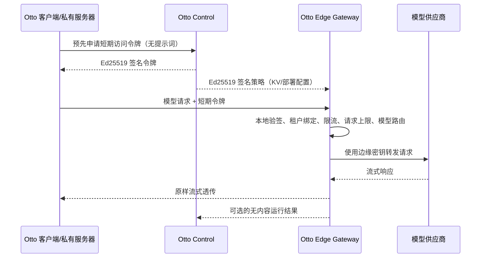

# Otto Edge Gateway 第一阶段设计与运行基线

## 当前交付状态

本阶段建立了可执行的 Edge Gateway 核心、Node 独立进程入口、阿里云 ESA
Web Service Worker 适配器、PostgreSQL 策略配置、Control 正式签发 API、Node
策略自动同步与安全内存缓存、签名公钥轮换、Redis 原子限流与临时封禁，以及安全
回归测试。Control 已校验部署、企业、在线 License、机器指纹和租约令牌；Node 单机
协调器已完成请求前额度预留、流式用量采集、签名凭证结算、失败释放及重启重放。
云边缘多地域共享聚合、真实环境演练和云部署自动化仍未完成，因此仍不能标记为
正式生产版本。

核心代码只依赖标准 Web API：`Request`、`Response`、`fetch`、
`ReadableStream` 和 Web Crypto。Node、阿里云 ESA 及未来 Cloudflare 只负责
适配运行环境，不能把平台 API 反向渗入核心。

## 信任与数据边界



必须长期保持以下安全不变量：

- Control 不进入模型请求的在线转发链路，只签发短期令牌和路由策略。
- Control、PostgreSQL、审计和运行结果不得接收提示词、回复、附件、会话上下文或
  模型密钥。
- 客户端只能选择策略公开的模型名，不能提供上游 URL、认证头或密钥绑定。
- 上游地址必须来自签名策略，并且只能是无凭据、无查询参数的 HTTPS URL。
- 每条签名路由还必须同时命中部署环境独立维护的精确 HTTPS Origin、Secret Binding
  和认证方式白名单；白名单拒绝或不可用时，在读取供应商 Secret 和建立网络连接之前
  fail-closed。
- Node HTTP 适配器只接受最长 8 KiB 的 origin-form request-target；客户端 `Host`、绝对 URL、
  authority-form、反斜线、片段、非法百分号转义、点段、控制字符和非 ASCII 原始字符均不能
  改变内部路由 origin；`Host` 不进入内部 Web Request。
- 模型密钥由边缘运行时的 Secret 管理能力提供，不写入策略、KV、日志或仓库。
- 策略失效、签名错误、令牌失效、密钥缺失时全部 fail-closed。
- BYOK 模式不经过托管 Edge Gateway，由客户端或私有服务器直连模型供应商。
- Edge 不承担聊天历史、知识库、附件或工作流状态存储。

## 已实现协议

Control 签发两类 Ed25519 信封，两者与 Otto 现有 `canonicalJson` 签名格式兼容：

1. 网关策略：绑定部署、企业、策略版本、公开模型、上游固定路由、Secret Binding、
   请求上限、每分钟速率、连接超时、流空闲超时和最大故障切换次数。有效期最长
   24 小时。流空闲超时范围为 1–300 秒。
2. 访问令牌：绑定部署、企业、账号、策略版本和模型白名单。有效期最长 15 分钟，
   默认 5 分钟。

网关当前提供以下兼容入口：

- `POST /v1/chat/completions`
- `POST /v1/responses`
- `GET /healthz`

Control 提供以下控制面入口：

- `PUT /v1/admin/deployments/:deploymentId/edge-gateway-policy`：持久化并审计策略；
- `GET /v1/admin/deployments/:deploymentId/edge-gateway-policy`：查询当前策略；
- `POST /v1/edge-gateway/policy/resolve`：签发 15 分钟策略信封；
- `POST /v1/edge-gateway/access-tokens`：签发默认 5 分钟的模型访问令牌。

两个部署入口都要求在线 License 的租约令牌，以及 `x-otto-timestamp`、
`x-otto-nonce`、`x-otto-signature`。签名算法与遥测请求相同：以租约令牌作为
HMAC-SHA256 密钥，对时间戳、nonce 和规范化请求体签名。nonce 持久化到
PostgreSQL 并一次性消费，跨实例重放会被拒绝。请求体采用字段白名单，不能携带
消息、提示词、上下文、上游 URL 或供应商密钥。

当前路由面向 OpenAI-compatible JSON 协议；网关只重写顶层 `model`，并以
`ReadableStream` 透传上游响应。429、502、503 和 504 可按签名策略的优先级
切换备用路由，其他 4xx 不会自动重试。连接超时只覆盖取得响应头之前；取得响应头
后，每次等待上游数据块都受 `upstreamIdleTimeoutMs` 约束。下游取消或连接断开会
中止供应商请求，避免无人接收的生成任务继续消耗 Token。

## 本地独立运行

先准备三个只读文件：

- `OTTO_EDGE_POLICY_FILE`：Control 签名的 `SignedEdgeGatewayPolicyV1` JSON。
- `OTTO_EDGE_CONTROL_PUBLIC_KEYS_FILE`：`signingKeyId -> Ed25519 SPKI PEM` 的 JSON。
- `OTTO_EDGE_UPSTREAM_ORIGINS_FILE`：部署方独立维护的上游精确 Origin 白名单。

白名单文件采用固定版本信封，例如：

```json
{
  "version": 2,
  "allowedUpstreams": [
    {
      "origin": "https://api.openai.com",
      "authentications": [
        {
          "type": "bearer",
          "secretBinding": "OPENAI_API_KEY"
        }
      ]
    },
    {
      "origin": "https://model-gateway.example.com:8443",
      "authentications": [
        {
          "type": "header",
          "headerName": "x-api-key",
          "secretBinding": "ENTERPRISE_MODEL_API_KEY"
        }
      ]
    }
  ]
}
```

v2 白名单必须包含 1–256 个上游，每个上游包含 1–16 个允许的认证组合。认证组合
精确绑定认证类型、Secret Binding，并在自定义 Header 模式下绑定 Header 名；因此
Control 即使错误地把其他供应商密钥绑定到已批准 Origin，也无法触发密钥读取或转发。
Origin 必须是无凭据、路径、查询或片段的 HTTPS Origin。协议、主机和
显式非默认端口都参与精确匹配；批准主机不会同时批准其子域名。签名策略仍负责固定
完整路径，部署白名单只提供第二道独立的目标主机边界。白名单不能替代出站防火墙和
受控 DNS；生产环境仍应限制网关只能连接批准的公网供应商地址，防范 DNS 重绑定及
错误的私网解析。旧 `version: 1`、`allowedOrigins` 文件仍可在迁移期读取，但它只绑定
Origin、不隔离 Secret Binding；正式部署应升级到 v2。

供应商 Secret 在去除首尾空白后必须为 1–8192 个 HTTP 可见 ASCII 字符。空值、内部
控制字符、非 ASCII 字符和超长值会在构造认证 Header 或建立上游连接前被拒绝。该规则
位于可移植网关核心中，Node 和 ESA 执行相同边界；密钥文件或 KMS 返回值末尾的换行可
安全去除，但密钥本身不得包含空白控制字符，也不得写入日志或错误响应。

模型 API 入口只接受协议定义的精确路径，不接受查询字符串或 URL 片段。它们不会被
静默忽略，也不会拼接到签名策略固定的供应商 URL；网关会在验令牌、解析 Secret 和
访问上游前返回 `EDGE_INVALID_HTTP_REQUEST`。需要供应商查询参数时，应把固定参数纳入
受签名的 `upstreamUrl`，不能让调用方动态覆盖。

网关不会把客户端 Header 集合复制给供应商。上游请求只重建固定的 `Content-Type`、
网关请求 ID、策略绑定的认证头和 `Accept`；`Accept` 不采用客户端值，而是由请求体中
已解析的 `stream === true` 固定选择 `text/event-stream`，其他请求固定使用
`application/json`。Cookie、客户端访问令牌、代理头以及伪造的供应商认证头不会越过
网关信任边界。

供应商响应 Header 同样不直接透传。仅允许 JSON、Problem JSON、NDJSON 和 SSE 媒体
类型；缺失或其他类型统一降级为 `application/octet-stream`，并始终返回
`X-Content-Type-Options: nosniff`，避免供应商 HTML 或脚本被浏览器按活动内容解释。
`x-request-id` 只有在去除首尾空白后为 1–256 个可见 ASCII 字符时，才会作为
`x-upstream-request-id` 暴露；异常值直接丢弃，不进入响应或日志。

请求体的 `stream` 字段只能缺省或使用 JSON 布尔值。字符串、数字、`null`、数组和
对象会在读取供应商 Secret 及访问上游前以 `EDGE_INVALID_REQUEST` 拒绝，避免供应商
按流式执行而网关按非流式进行 Header、用量和计费处理。

策略中的每个 `secretBinding` 对应同名进程环境变量。例如
`PROVIDER_A_API_KEY`。然后运行：

```powershell
$env:OTTO_EDGE_POLICY_FILE='D:\secure\edge-policy.json'
$env:OTTO_EDGE_CONTROL_PUBLIC_KEYS_FILE='D:\secure\control-public-keys.json'
$env:OTTO_EDGE_UPSTREAM_ORIGINS_FILE='D:\secure\edge-upstream-origins.json'
$env:PROVIDER_A_API_KEY='从密钥管理服务注入的值'
npm run dev:edge
```

默认只监听 `127.0.0.1:7790`。生产环境应在前方终止 TLS，且必须改用正式的
分布式限流器；内置 `InMemoryEdgeRateLimiter` 只适合开发和单隔离实例。

## Control 自动同步模式

生产 Node 网关可以不配置静态策略文件，改为从 Control 自动领取短期签名策略。
准备以下四个只读文件或配置：

- `OTTO_EDGE_CONTROL_PUBLIC_KEYS_FILE`：首次安装时独立核验过的 Control Ed25519
  引导信任根；文件中的每把密钥必须出现在 Control 公布的 Keyring 中；
- `OTTO_EDGE_DEPLOYMENT_IDENTITY_FILE`：仅包含 `licenseId`、`deploymentId`、
  `organizationId` 和 64 位十六进制 `machineFingerprint` 的 JSON；
- `OTTO_EDGE_LEASE_TOKEN_FILE`：只包含在线 License 租约令牌，不把令牌放入环境变量。
- `OTTO_EDGE_UPSTREAM_ORIGINS_FILE`：由部署方独立审批的精确 HTTPS Origin 白名单，
  不能由 Control 下发的签名策略自动扩宽。

```powershell
$env:OTTO_EDGE_CONTROL_URL='https://control.example.com'
$env:OTTO_EDGE_CONTROL_PUBLIC_KEYS_FILE='D:\secure\control-public-keys.json'
$env:OTTO_EDGE_UPSTREAM_ORIGINS_FILE='D:\secure\edge-upstream-origins.json'
$env:OTTO_EDGE_DEPLOYMENT_IDENTITY_FILE='D:\secure\edge-identity.json'
$env:OTTO_EDGE_LEASE_TOKEN_FILE='D:\secure\edge-lease-token'
$env:OTTO_EDGE_POLICY_REFRESH_BEFORE_EXPIRY_MS='60000'
$env:OTTO_EDGE_CONTROL_TIMEOUT_MS='10000'
$env:OTTO_EDGE_KEYRING_REFRESH_INTERVAL_MS='60000'
$env:OTTO_EDGE_KEYRING_REFRESH_BEFORE_EXPIRY_MS='60000'
$env:OTTO_EDGE_UNKNOWN_KEY_RETRY_MS='10000'
$env:OTTO_EDGE_KEYRING_FAILURE_RETRY_MS='5000'
$env:OTTO_EDGE_BILLING_BACKEND='control'
$env:OTTO_EDGE_EXECUTION_RECEIPT_KEY_FILE='D:\secure\edge-receipt-private.pem'
$env:OTTO_EDGE_BILLING_JOURNAL_FILE='D:\state\edge-billing.ndjson'
$env:OTTO_EDGE_BILLING_RETRY_INTERVAL_MS='10000'
$env:OTTO_EDGE_OPERATIONS_TOKEN_FILE='D:\secure\edge-operations.token'
$env:OTTO_EDGE_MAX_CONCURRENT_REQUESTS='256'
$env:OTTO_EDGE_MAX_CONCURRENT_REQUESTS_PER_SUBJECT='8'
$env:OTTO_EDGE_CIRCUIT_BREAKER_FAILURE_THRESHOLD='5'
$env:OTTO_EDGE_CIRCUIT_BREAKER_COOLDOWN_MS='30000'
$env:OTTO_EDGE_CIRCUIT_BREAKER_MAXIMUM_ENTRIES='10000'
$env:OTTO_EDGE_HTTP_HEADERS_TIMEOUT_MS='15000'
$env:OTTO_EDGE_HTTP_REQUEST_TIMEOUT_MS='120000'
$env:OTTO_EDGE_HTTP_KEEP_ALIVE_TIMEOUT_MS='5000'
$env:OTTO_EDGE_HTTP_MAX_HEADER_BYTES='16384'
$env:OTTO_EDGE_HTTP_MAX_HEADERS_COUNT='100'
$env:OTTO_EDGE_HTTP_MAX_CONNECTIONS='1024'
$env:OTTO_EDGE_HTTP_MAX_REQUESTS_PER_SOCKET='1000'
$env:OTTO_EDGE_MAX_REQUEST_BYTES='4194304'
$env:OTTO_EDGE_UPSTREAM_MAX_RESPONSE_BYTES='67108864'
$env:OTTO_EDGE_UPSTREAM_MAX_RESPONSE_DURATION_MS='900000'
$env:OTTO_EDGE_SHUTDOWN_GRACE_MS='30000'
npm run dev:edge
```

`OTTO_EDGE_CONTROL_URL` 与 `OTTO_EDGE_POLICY_FILE` 互斥。自动同步请求使用租约令牌
HMAC、时间戳和一次性 nonce 认证，并禁止 HTTP、URL 凭据、查询和片段。并发刷新
会合并为一个请求。新策略只有在本地完成结构校验、Ed25519 验签、部署/企业绑定
检查和签发时间防回滚检查后才会进入内存缓存；伪造、错租户、回滚或冲突策略不会
污染现有缓存。Control 暂时不可用时，只能继续使用仍处于其签名有效期内的旧策略；
一旦策略过期即 fail-closed，不会写盘，也不会无限宽限。

签名有效不代表路由自动获准：网关会取“签名策略路由”与本地 Origin、Secret Binding、
认证方式白名单的交集。
没有可用交集时返回 `EDGE_UPSTREAM_NOT_ALLOWED`；本地策略自身异常时返回
`EDGE_UPSTREAM_POLICY_UNAVAILABLE`。两种情况都不会解析供应商 Secret、建立上游连接
或回显本地策略异常详情。更新白名单需要按部署配置变更流程审批并重启网关。

Node 网关会同时从 `/v1/signing-keyring` 同步十分钟有效的签名公钥清单。Keyring
必须由当前已信任且未撤销的活动密钥签名；新密钥必须先作为 `standby` 出现在旧密钥
签名的清单里，随后才能激活并签发下一版清单。刷新后，`revoked` 密钥立即停止验证
策略和访问令牌。Keyring 版本回退、同版本状态冲突、删除既有密钥、替换同 ID 公钥
或恢复已撤销密钥都会 fail-closed。正常情况下每分钟检查一次；失败请求有退避，同一
未知 Key ID 也有强制发现频率限制，避免攻击者放大 Control 流量。Control 断开时只
能使用尚未过期的已验证 Keyring，超过签名有效期后停止验签。

引导信任根仍需通过安装包签名、受控配置或带外指纹核验交付，不能通过首次联网直接
信任。轮换顺序必须是“发布 standby—等待网关同步—激活—验证—退役/撤销”；紧急
撤销也必须使用已提前分发的替代密钥签发新 Keyring。

## Redis 分布式限流与异常封禁

Node 网关可使用 Redis 作为跨实例权威限流器。限流窗口、超限异常计数和临时封禁在
同一个 Lua 脚本中原子更新，三个键使用相同 Redis Cluster hash tag，多个网关实例不会
各自放大配额。Redis 键只包含使用独立密钥计算的 HMAC-SHA-256，不包含部署、企业或
账号原文。普通超限返回 `EDGE_RATE_LIMITED`；在异常计数窗口内连续超限达到阈值后
返回 `EDGE_TRAFFIC_BANNED`。两者均提供整数秒 `Retry-After`。

```powershell
$env:OTTO_EDGE_RATE_LIMIT_BACKEND='redis'
$env:OTTO_EDGE_REDIS_URL='rediss://edge:<password>@redis.internal:6379/2'
$env:OTTO_EDGE_RATE_LIMIT_KEY_FILE='D:\secure\edge-rate-limit.key'
$env:OTTO_EDGE_RATE_LIMIT_PREFIX='otto-production'
$env:OTTO_EDGE_REDIS_CONNECT_TIMEOUT_MS='10000'
$env:OTTO_EDGE_RATE_LIMIT_BAN_THRESHOLD='20'
$env:OTTO_EDGE_RATE_LIMIT_STRIKE_WINDOW_MS='300000'
$env:OTTO_EDGE_RATE_LIMIT_BAN_MS='900000'
```

HMAC 密钥文件必须是 32–4096 字节的独立随机秘密，不能复用 License、Control、模型或
数据库密钥，也不能写入环境变量、日志和镜像。默认只接受 `rediss://`；仅隔离开发网络
可以显式设置 `OTTO_EDGE_REDIS_ALLOW_INSECURE=true` 使用 `redis://`。启动时连接或
PING 失败会拒绝启动；运行期间 Redis 超时、断开或返回畸形结果时网关返回
`EDGE_RATE_LIMIT_UNAVAILABLE`，不得回退进程内计数。内存后端仍保留给开发和明确的
单隔离实例。

## 单机并发背压

Node 网关在每分钟限流之外，还使用进程内并发槽保护单服务器。默认最多同时处理 256 个
模型请求，同一账号最多占用 8 个槽，可分别通过
`OTTO_EDGE_MAX_CONCURRENT_REQUESTS` 和
`OTTO_EDGE_MAX_CONCURRENT_REQUESTS_PER_SUBJECT` 调整；单账号上限不得超过全局上限。
并发槽从访问令牌和请求体完成校验后开始占用，一直保留到上游响应流正常结束、超时、
失败或被下游取消。只有拿到响应头并不代表释放，慢速流仍持续占用容量。

超过任一上限返回 429 `EDGE_CONCURRENCY_LIMITED` 和短期 `Retry-After`，不会访问模型
供应商，也不会创建计费 Hold。并发限制器自身异常时返回 503
`EDGE_CONCURRENCY_UNAVAILABLE`，不得绕过保护继续转发。槽位释放是幂等的；计费拒绝、
缺少计费协调器、全部路由失败、无效上游响应和客户端中断均有回归测试。该实现适合当前
单 Node 进程部署；同一服务器启动多个 Node 进程时，每个进程仍会拥有独立上限，应使用
进程管理器只启动一个网关实例，或在未来切换为共享并发租约服务，不能把各实例的配置值
误认为集群总上限。

## 上游线路熔断与半开探测

Node 网关为签名策略中的每个路由维护有界的进程内故障状态。默认连续 5 次连接失败、
429/502/503/504 或响应流失败后打开线路 30 秒；冷却期间直接跳过该线路并按签名策略
优先级尝试备用路由，不会读取客户端提供的地址。冷却结束后只允许一个半开探测请求，
并发请求继续使用备用路由。探测成功会清除连续失败状态，探测失败会重新开始完整冷却；
客户端主动取消不会被误判为供应商故障。

阈值、冷却时间和最多保留的线路状态分别由
`OTTO_EDGE_CIRCUIT_BREAKER_FAILURE_THRESHOLD`、
`OTTO_EDGE_CIRCUIT_BREAKER_COOLDOWN_MS` 和
`OTTO_EDGE_CIRCUIT_BREAKER_MAXIMUM_ENTRIES` 配置。状态表达到容量时淘汰最久未更新项，
避免长期策略轮换导致内存无界增长。熔断器异常时返回 503
`EDGE_CIRCUIT_BREAKER_UNAVAILABLE` 且不访问供应商。该状态只包含策略路由 ID、连续失败数
和时间，不保存租户正文、提示词、回复、密钥或账号标识。

熔断以单 Node 进程为边界，适合当前单服务器单进程方案。多个进程各自判断线路健康，
不能把它宣传为全局线路摘除；多实例正式方案需要共享健康协调器或由云负载均衡/WAF
承担全局故障检测。

线路健康准入发生在供应商 Secret 解析之前。冷却期内被熔断的路由不会调用环境密钥、
KMS 或 Vault；半开探测若暂时缺少有效 Secret，会取消本次探测租约并保留后续重试机会，
不会把线路永久卡在 `half-open`，也不会把密钥缺失错误计为供应商网络故障。

## 入站 HTTP 资源边界

Node 网关不使用运行时的无限连接默认值。请求头必须在 15 秒内完成，整个请求体必须在
120 秒内上传完成，空闲 keep-alive 连接保留 5 秒；总头部最多 16 KiB，应用最多接收
100 个头部，进程最多同时接收 1024 个 socket，同一 socket 最多处理 1000 个请求。达到
连接总数上限的新 socket 会在进入 HTTP、鉴权和业务并发层之前被拒绝。超时连接由 Node
直接以 408 终止，超过
总头部字节容量的请求以 431 拒绝，不会进入策略、计费或模型转发。上述七项分别通过
`OTTO_EDGE_HTTP_HEADERS_TIMEOUT_MS`、`OTTO_EDGE_HTTP_REQUEST_TIMEOUT_MS`、
`OTTO_EDGE_HTTP_KEEP_ALIVE_TIMEOUT_MS`、`OTTO_EDGE_HTTP_MAX_HEADER_BYTES`、
`OTTO_EDGE_HTTP_MAX_HEADERS_COUNT`、`OTTO_EDGE_HTTP_MAX_CONNECTIONS` 和
`OTTO_EDGE_HTTP_MAX_REQUESTS_PER_SOCKET` 调整；
头部期限不得大于整请求期限，所有配置均有硬边界且在监听端口前应用。反向代理仍应
配置自己的连接、头部和请求体限制，不能只依赖应用层边界。

## 请求体本地硬上限

签名策略的 `maxRequestBytes` 不能单独决定网关进程愿意接收的请求大小。Node 和 ESA
核心还执行独立的本地硬上限，实际限制始终为“签名策略值与本地值的较小者”。默认
本地值为 4 MiB；Node 可通过 `OTTO_EDGE_MAX_REQUEST_BYTES` 调整，允许范围为 1 KiB
至 20 MiB，非法或越界配置会在监听端口前拒绝启动；ESA 通过 `requestLimits` 注入。
请求声明的 `Content-Length` 或实际读取字节数超过有效上限时返回 413
`EDGE_REQUEST_TOO_LARGE`，不会读取供应商 Secret、创建计费 Hold 或连接模型供应商。
该限制约束原始 JSON 字节，并不等同于 Token 数量或模型上下文窗口；模型级 Token
预算仍应由签名路由策略和供应商配置另行限制。

## 上游响应总量与总时长硬上限

流空闲超时只能阻止完全不返回数据的供应商，不能阻止持续发送小数据块的异常或恶意
响应。网关因此在签名策略之外再执行本地硬上限：默认单次上游响应最多 64 MiB、最长
15 分钟。字节数超过上限时立即中止供应商连接并以 `response_limit_exceeded` 记录无内容
结果；即使数据块持续到达并反复刷新空闲计时器，总时长到期仍会以
`stream_timed_out` 中止。计费请求没有完整可信用量时标记为待核对，不会根据截断内容
低估费用。

Node 运行时通过 `OTTO_EDGE_UPSTREAM_MAX_RESPONSE_BYTES` 和
`OTTO_EDGE_UPSTREAM_MAX_RESPONSE_DURATION_MS` 设置更严格的本地值，分别限制在
1 KiB 至 256 MiB、1 秒至 1 小时；配置越界会拒绝启动。ESA 适配器通过
`responseLimits` 设置同一边界。这些值是运行环境的安全上限，不改变或扩宽 Control
签发的 v1 策略，因此旧策略的签名与校验格式保持不变。

## 优雅下线与有界排空

Node 网关收到 `SIGTERM` 或 `SIGINT` 后会先进入 `draining`：`GET /healthz` 继续表示
进程存活，`GET /readyz` 立即返回 503，新的模型和写操作返回 503
`EDGE_GATEWAY_DRAINING`，已经进入 HTTP 适配器的请求则继续完成。排空统计覆盖鉴权、
错误响应、上游流和向下游写回的完整生命周期，不会在仅取得供应商响应头时提前退出。

默认宽限期为 30 秒，可通过 `OTTO_EDGE_SHUTDOWN_GRACE_MS` 配置为 1 秒至 5 分钟。
存量请求全部结束后关闭监听器并标记 `stopped`；超过宽限期则强制关闭剩余连接并设置
非零退出码，让进程管理器能够识别非正常排空。第二次终止信号会立即强制断开连接。
排空期间仍允许存活、就绪和只读运维状态检查；运维状态只披露状态、活跃请求数和排空
开始时间，不包含租户、账号、提示词、回复、上游地址或密钥。

## 单机持久化计费与可信用量

签名策略可为每条 OpenAI-compatible 路由配置 `metering.type=openai_tokens` 和
`reserveUnits`。计费路由在首次访问供应商前必须由协调器调用
`POST /v1/billing/holds` 完成额度预留；余额不足返回 402 `EDGE_CREDIT_REQUIRED`，
Control 或本地协调器不可用返回 503 `EDGE_BILLING_UNAVAILABLE`，两种情况都不会调用
模型供应商。Control 新增
`POST /v1/billing/holds/:holdId/execution-receipts`，在同一数据库事务中验证签名执行
凭证、捕获实际费用、释放剩余额度并写入凭证，避免 Hold 与直接消费造成双扣。

流式 Chat Completions 请求会强制设置 `stream_options.include_usage=true`，同时保留
供应商已有的其他 `stream_options`。扫描器逐块检查最终 `usage`，支持 Responses API
和 Chat Completions 两套完整字段组，只接受非负安全整数且要求
`input + output = total`。它不会缓冲提示词或回复；唯一可能暂存的是最大 16 KiB 的
`usage` JSON 对象，客户端收到的字节不被修改。供应商已经开始执行但流被取消、超时、
失败或缺失可信 usage 时，Hold 标记为待核对而不是按零用量释放。

Node 单进程协调器使用独立 Ed25519 私钥生成 `ExecutionReceiptV2`，启动时向 Control
登记公钥。严格递增序列、待结算、待释放和不确定状态写入只追加、逐条 SHA-256 链接、
每次 `fsync` 的 NDJSON 日志；启动时任何截断或哈希错误都会 fail-closed。断网后会按
序重试，同一请求使用稳定幂等键。以下配置必须指向权限受控的持久卷和只读密钥文件：

- `OTTO_EDGE_BILLING_BACKEND=control`；
- `OTTO_EDGE_EXECUTION_RECEIPT_KEY_FILE`：Ed25519 PKCS#8 PEM 私钥；
- `OTTO_EDGE_BILLING_JOURNAL_FILE`：本机追加日志，不能放在 NFS/SMB；
- `OTTO_EDGE_BILLING_RETRY_INTERVAL_MS`：1 秒至 1 小时，默认 10 秒。

该日志方案只适合用户当前要求的单服务器、单 Edge 进程模式。多进程或多地域不能共享
日志文件，必须替换为 PostgreSQL/专用队列上的单一有序聚合器，否则严格递增凭证序列
会产生竞争。

## 健康检查与受保护恢复

`GET /healthz` 只表示进程仍存活，不读取策略、Redis、Control 或本地计费日志。
`GET /readyz` 会实际检查当前签名策略和限流后端，并汇总计费协调器状态：`ready` 和
`degraded` 返回 200，无法安全接单的 `unavailable` 返回 503。公开响应只包含服务名和
分类，不披露租户、请求、余额、文件路径或内部地址。重启后尚未归档的 Hold、待核对
用量会标记为 `degraded`；未能同步的结算或释放队列会标记为 `unavailable`。

如配置 `OTTO_EDGE_OPERATIONS_TOKEN_FILE`，Node 网关额外启用：

- `GET /v1/operations/status`：返回计费状态和聚合计数，不返回请求 ID、企业标识、金额
  或密钥；同时返回当前并发数、全局上限、活跃账号数量和达到单账号上限的账号数量，
  以及故障、打开、可探测和半开线路数量，不返回账号或线路标识；
- `POST /v1/operations/billing/retry`：只重试已经写入防篡改日志的待处理操作，不能创建、
  修改或跳过凭证，也不能人工改序号或金额。

运维令牌必须是独立的 32–8192 字符不透明随机字符串，通过只读文件挂载，不能复用
Control 租约、License、Redis、模型或签名密钥。两个接口都要求 Bearer 认证、禁止缓存，
错误响应不会回显内部异常。重试完成后若队列仍未清空，接口继续返回 503，不会将失败
伪装成恢复成功。

## 阿里云 ESA 接入

`createAliyunEsaGateway` 接受 ESA `EdgeKV` 读取器、Control 公钥集合、Secret
解析器、限流器和必填的 `upstreamOriginPolicy`，并返回官方 Web Service Worker
风格的 `fetch(request)` 入口。该本地策略应由 ESA 部署配置独立构造和注入，不能直接
复用 EdgeKV 中的签名策略路由列表。
部署引导层负责构造 `EdgeKV` 以及绑定 ESA 的 Secret，业务核心不引用任何全局
平台对象。

签名策略适合放入 ESA EdgeKV，因为策略属于低频写、高频读的配置。ESA EdgeKV
是最终一致性存储，不得用于严格的跨节点计费、一次性令牌消费或全局配额。生产
速率控制应组合 ESA 原生流量规则和一个支持原子消费的限流器。ESA 适配器当前仍只有
余额准入，尚未接入 Node 的本地持久化计费协调器；正式 ESA 计费必须由共享有序聚合
服务处理，不能在每个边缘节点各自生成凭证序列。

## 运行结果与计费边界

`EdgeGatewayOutcomeV2` 只包含请求 ID、令牌 ID、租户绑定、模型、路由、HTTP 状态、
耗时、终止结果及校验后的 Token 汇总，不包含消息、提示词、回复或密钥。它用于运维
和对账；正式扣费只信任由协调器持久化并签名的 `ExecutionReceiptV2`。多个边缘实例
不能各自生成严格递增凭证，否则会产生跨节点竞争和错误拒绝。

## 测试工具与门禁

Edge Gateway 使用三层测试工具：

- Vitest：正向、反向、边界和异常场景；
- fast-check：属性测试与可复现 Fuzz，每轮生成 1,800 组限流、并发租约、熔断边界、窗口、畸形令牌、
  签名变异、协议和认证头输入；
- Stryker + Vitest Runner：对 `gateway.ts`、`control-keyring-verifier.ts`、
  `control-policy-source.ts`、`control-billing-coordinator.ts`、`circuit-breaker.ts`、
  `concurrency-limit.ts`、`lifecycle.ts`、`node-http-adapter.ts`、
  `node-http-limits.ts`、`provider-secret.ts`、`request-limits.ts`、
  `upstream-response-headers.ts`、`upstream-response-limits.ts`、
  `upstream-origin-policy.ts`、`usage-meter.ts`、
  `protocol.ts`、`rate-limit.ts`、`redis-rate-limit.ts`
  和 Control 签发服务
  执行代码变异测试。

```bash
npm run test:edge
npm run test:property
npm run test:mutation:dry
npm run test:mutation
```

变异门禁保留条件、比较、正则、逻辑、数组、对象和代码块变异，排除只改变错误
提示文案的 `StringLiteral` 变异。最低门槛为 80%；最近一次全量正式基线总分为 81.29%，
已覆盖代码为 81.51%。其中 Redis 分布式限流为 86.62%、限流与输入校验层为 84.38%、
公钥轮换模块为 81.11%、策略自动同步器为 81.70%、Control 签发服务为 82.77%、
本次修改后独立复验的网关核心为 81.36%、用量解析器为 80.41%、单机计费协调器为
81.68%、单机并发限制器为 100%、优雅排空状态机为 100%、Node HTTP 适配器为 100%、
Node HTTP 资源边界为 100%、上游响应限制配置为 100%、上游熔断器为 96.06%、协议层为
77.88%、本地请求限制配置为 100%、本地上游 Origin 与凭据绑定策略为 99.01%。
供应商 Secret Header 安全校验模块为 100%。
模型 API 精确路径判断的本次行范围变异复验为 100%。
上游 `Accept` 派生和最小 Header 重建的本次行范围变异复验为 100%。
供应商响应 Header 归一化模块为 100%。
`stream` 布尔协议判断的本次行范围变异复验为 100%。
熔断前置与半开探测租约释放的本次行范围变异复验为 100%。
单个协议文件低于总体门槛时仍应继续补强，不能用总体分数掩盖薄弱模块。
HTML 和 JSON 报告生成到忽略提交的 `reports/mutation/`。变异测试不放入每次快速
`npm run check`，应在 Edge 关键代码变化或定时安全测试环境中执行。

## 正式生产前剩余门禁

- 将 Node 单机凭证日志升级为多实例共享的 PostgreSQL/队列有序聚合器；
- 在真实 Redis Cluster/哨兵环境完成故障转移、时钟边界、热 Key 和封禁解除演练；
- 为非 OpenAI-compatible 供应商增加已审查的用量适配器，并完成账单对账演练；
- 完成 ESA Secret、KV、WAF、域名、TLS、灰度、回滚和 Terraform/ROS 部署；
- 将签名 Keyring 的同等撤销语义接入 ESA 分发，并完成双钥重叠、紧急撤销和回滚演练；
- 增加断网、跨地域策略轮换和至少 24 小时长稳测试；慢流超时和连接中断已有确定性
  回归测试，但仍需纳入长稳与故障注入环境；
- 完成外部安全审计、成本压测和模型供应商数据处理协议审查。
